<div align="center">
  

# YouTube Content Intelligence Platform

[](https://youtube-content-intelligence.streamlit.app/)

[](https://www.python.org/downloads/)
[](https://streamlit.io)
[](https://scikit-learn.org/)
[](https://opensource.org/licenses/MIT)

*An end-to-end, production-ready machine learning pipeline and interactive dashboard designed to analyze and predict YouTube video performance while strictly preventing data leakage.*

</div>

---

## 🎯 Project Overview
This platform answers a critical question for creators and analysts: *"What pre-publication characteristics are associated with successful YouTube videos, and can we predict if a new video will perform well?"*

Instead of relying on post-publication metrics (like comments or early views), this ML pipeline predicts performance using **only** data available *before* hitting publish (e.g., Title structure, Video duration, Upload timing, Channel size).

## 🏗️ Architecture

The project is built on a clean, modular ELT (Extract, Load, Transform) and ML architecture:

```mermaid
graph LR
    %% Styling
    classDef api fill:#ff0000,stroke:#fff,stroke-width:2px,color:#fff;
    classDef process fill:#1e1e1e,stroke:#fff,stroke-width:1px,color:#fff;
    classDef db fill:#0e1117,stroke:#ff0000,stroke-width:1px,color:#fff;
    classDef ml fill:#0055ff,stroke:#fff,stroke-width:2px,color:#fff;
    classDef dash fill:#00b8ff,stroke:#fff,stroke-width:2px,color:#000;

    %% Nodes
    API[YouTube API v3]:::api
    Raw[(Raw CSV)]:::db
    Clean[Cleaner & FE]:::process
    Proc[(Processed CSV)]:::db
    Train[ML Training]:::ml
    Model[(Saved Models)]:::db
    Dash[Streamlit UI]:::dash

    %% Flow
    API -->|src/collector.py| Raw
    Raw -->|src/cleaner.py| Clean
    Clean -->|src/feature_engineering.py| Proc
    Proc -->|src/train.py| Train
    Train -->|joblib| Model
    Proc -.->|Data Analysis| Dash
    Model -.->|Real-time Predictions| Dash
```



### Core Modules
1. **Collector (`src/collector.py`)**: Batches requests to the YouTube Data API v3, handling pagination and deduplication.
2. **Cleaner (`src/cleaner.py`)**: Parses ISO 8601 durations and sanitizes missing values.
3. **Feature Engineering (`src/feature_engineering.py`)**: Extracts predictive metadata (e.g., uppercase ratio, upload hour) while explicitly isolating post-publication metrics to prevent target leakage.
4. **Machine Learning (`src/train.py`)**: Trains an ensemble of models (Gradient Boosting, Random Forest) for both classification (Top 25% performance) and regression (log-views).
5. **Dashboard (`dashboard/app.py`)**: A premium, "glassmorphism" styled Streamlit interface featuring Plotly analytics and real-time ML inferencing.
6. **Orchestrator (`run.py`)**: A CLI entry point supporting single-runs or continuous daemon scheduling.

---

## 🚀 Setup & Installation

### 1. Clone the Repository
```bash
git clone https://github.com/jemmziray-tech/youtube-content-intelligence.git
cd youtube-content-intelligence
```

### 2. Create Virtual Environment
```bash
python -m venv .venv
# Windows
.\.venv\Scripts\Activate.ps1
# Mac/Linux
source .venv/bin/activate

pip install -r requirements.txt
```

### 3. API Configuration
1. Obtain a **YouTube Data API v3** key from the [Google Cloud Console](https://console.cloud.google.com/).
2. Create a `.env` file in the project root:
```env
YOUTUBE_API_KEY=your_api_key_here
```

---

## 💻 Usage

The entire platform is orchestrated via `run.py`.

**Run the Full Data Pipeline (Collect ➔ Clean ➔ Train):**
```bash
python run.py --collect
```

**Launch the Interactive Dashboard:**
```bash
python run.py --dashboard
```

**Run as a Continuous Background Daemon (e.g., fetch new data every 24 hours):**
```bash
python run.py --daemon 24
```

---

## ☁️ Deploying to Streamlit Community Cloud

If you want to host this dashboard live for free on [Streamlit Community Cloud](https://share.streamlit.io/):

1. **Push this repository** to your GitHub account.
2. **Log into Streamlit Community Cloud** with your GitHub account and click **"New app"**.
3. Point it to your repository, branch (`main`), and main file path (`dashboard/app.py`).
4. **Configure Secrets (Crucial!):** Before clicking deploy, click on **"Advanced settings"**. In the **Secrets** field, paste your API key exactly like your `.env` file:
   ```toml
   YOUTUBE_API_KEY="your_api_key_here"
   ```
5. Click **Deploy!**

---

## 🧠 Machine Learning Approach

**Strict Data Leakage Prevention:**
A common mistake in YouTube analytics is training models using "Likes" or "Comments" to predict "Views". This is *target leakage*. This platform strictly separates:
- **Prediction Features:** Title length, Uppercase ratio, Video duration, Upload Day/Hour, Channel subscriber count.
- **Analysis Features (Excluded from ML):** Likes, Comments, Engagement Rate, Actual Views.

**Model Evaluation (Current Best):**
- *Classification (High Performing):* Gradient Boosting Classifier (ROC-AUC: ~0.80)
- *Regression (Log Views):* Random Forest Regressor ($R^2$: ~0.71)

## ⚖️ Limitations & Ethics
- **Algorithmic Opacity:** YouTube's recommendation algorithm is proprietary and heavily influenced by user history and thumbnail CTR, which are not accessible via the API. This model estimates baseline potential, not guaranteed virality.
- **API Quotas:** Frequent bulk data collection will exhaust standard free-tier API quotas.
